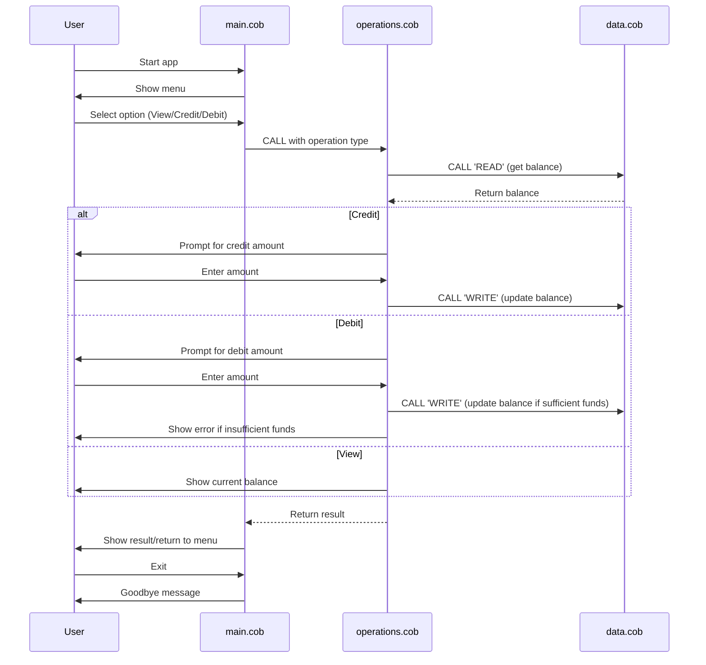

# COBOL Student Account Management System

This project is a simple COBOL-based system for managing student accounts, including viewing balances, crediting, and debiting accounts. The system is organized into three main COBOL files, each with a specific role.

## File Overview

### 1. `main.cob`
**Purpose:**
- Acts as the entry point and user interface for the account management system.
- Presents a menu to the user for viewing balance, crediting, debiting, or exiting.
- Handles user input and delegates operations to the `operations.cob` module.

**Key Functions:**
- Displays the main menu and processes user choices.
- Calls the `Operations` program with the appropriate operation type (`TOTAL`, `CREDIT`, `DEBIT`).
- Manages the main program loop and exit condition.

### 2. `operations.cob`
**Purpose:**
- Implements the core business logic for account operations.
- Handles credit, debit, and balance inquiry requests.
- Interacts with the data storage module (`data.cob`).

**Key Functions:**
- Receives the operation type from `main.cob`.
- For `TOTAL`: Calls `DataProgram` to read and display the current balance.
- For `CREDIT`: Prompts for an amount, reads the current balance, adds the amount, updates the balance, and displays the new balance.
- For `DEBIT`: Prompts for an amount, checks if sufficient funds exist, subtracts the amount if possible, updates the balance, and displays the new balance. If insufficient funds, displays an error message.

**Business Rules:**
- Debit operations are only allowed if the account has sufficient funds.
- All balance updates are persisted via the data module.

### 3. `data.cob`
**Purpose:**
- Manages persistent storage of the account balance.
- Provides read and write operations for the balance.

**Key Functions:**
- For `READ`: Returns the current stored balance.
- For `WRITE`: Updates the stored balance with the new value.

**Business Rules:**
- The balance is initialized to 1000.00 by default.
- Only the `DataProgram` module should directly modify the stored balance.

## Business Rules Summary
- The system starts with a default balance of 1000.00.
- Credit and debit operations update the balance accordingly.
- Debit operations are blocked if the requested amount exceeds the current balance.
- All operations are performed through modular program calls for maintainability and separation of concerns.

---

For more details, see the source code in `/src/cobol/`.

---

## Sequence Diagram: Data Flow

